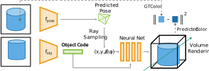
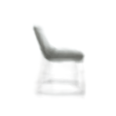

# ViewNerf[[PDF](https://arxiv.org/pdf/2212.00436)]

## Unsupervised category viewpoint estimation with neural rendering

<p align="center"></p>

### Installation

```
conda env create -f spec.yml
```

### Training

Specify the dataset and log path in `config/conf_file.yaml` then run:

```python
python train.py --config config/conf_file.yaml
```

### Visualizations

<p align="center"></p>

### Acknowledgment

Some functions in this repo -namely the NeRF-related bits- directly come from the [GIRAFFE GitHub repo](https://github.com/autonomousvision/giraffe)

### Citation

If you use this this code for your research, please cite our paper using:

```
@inproceedings{Mariotti_2022_BMVC,
author    = {Octave Mariotti and Oisin Mac Aodha and Hakan Bilen},
title     = {ViewNeRF: Unsupervised Viewpoint Estimation Using Category-Level Neural Radiance Fields},
booktitle = {33rd British Machine Vision Conference 2022, {BMVC} 2022, London, UK, November 21-24, 2022},
publisher = {{BMVA} Press},
year      = {2022},
url       = {https://bmvc2022.mpi-inf.mpg.de/0740.pdf}
}
```
